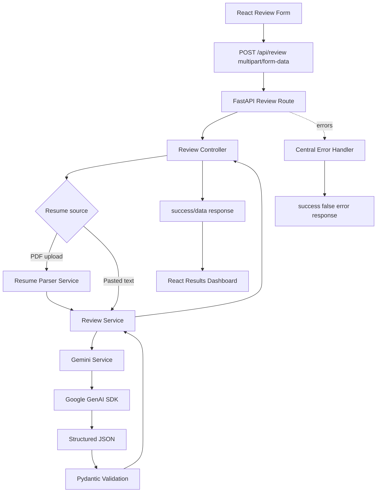

# AI Resume Reviewer

AI Resume Reviewer is a full-stack SaaS-style MVP that compares a resume against a target job description and returns structured AI feedback on fit, evidence, ATS-style keyword coverage, skill gaps, section quality, bullet rewrites, and next-step recommendations.

The app is intentionally lightweight: no authentication, no database, no queues, and no persistent resume storage. It is designed as a focused AI application architecture sample with a polished React workspace and a FastAPI backend that validates AI output before returning it to the browser.

## Highlights

- Upload a PDF resume or paste resume text.
- Paste a target job description for role-specific analysis.
- Extract PDF text with `pypdf`.
- Call Gemini through the official `google-genai` SDK.
- Request structured JSON from the AI provider.
- Validate the AI response with Pydantic before the frontend renders it.
- Return consistent success and error response shapes.
- Render a professional results dashboard with match scores, skill gaps, keyword analysis, section reviews, bullet improvements, and recommendations.
- Keep API keys on the backend only.

## Tech Stack

### Frontend

- React 19
- Vite
- TypeScript
- Tailwind CSS
- shadcn/ui-style primitives
- Lucide React
- React Hook Form
- Zod
- React Router
- Vitest + React Testing Library

### Backend

- FastAPI
- Pydantic v2
- pydantic-settings
- pypdf
- python-multipart
- google-genai
- pytest

## Architecture



Request flow:

1. The frontend submits a `multipart/form-data` request with either a PDF resume or pasted resume text, plus a job description.
2. The backend validates the request shape and rejects invalid inputs early.
3. If a PDF is provided, the parser extracts text and enforces PDF-only and file-size limits.
4. The review service checks that the resume text and job description are usable.
5. The Gemini service sends the prompt, resume text, and job description to Gemini.
6. Gemini returns structured JSON.
7. Pydantic validates the AI response schema and score bounds.
8. The frontend renders the results dashboard or a friendly error state.

## Project Structure

```text
AI_Resume_reviewer/
  backend/
    app/
      api/
        routes/
      controllers/
      core/
      middleware/
      prompts/
      schemas/
      services/
      utils/
    scripts/
    tests/
    .env.example
    requirements.txt
    README.md

  frontend/
    src/
      assets/
      components/
        landing/
        layout/
        results/
        review/
        ui/
      lib/
      pages/
      test/
      types/
    package.json
    vite.config.ts
    README.md

  README.md
```

## Environment Variables

Create `backend/.env` from `backend/.env.example`.

```env
GEMINI_API_KEY=your_google_gemini_api_key
PORT=8000
FRONTEND_URL=http://localhost:5173
```

`GEMINI_API_KEY` is required. The backend fails fast at startup if it is missing.

## Installation

### Backend

From the project root:

```powershell
cd backend
python -m venv .venv
.\.venv\Scripts\Activate.ps1
pip install -r requirements.txt
```

### Frontend

From the project root:

```powershell
cd frontend
npm install
```

## Running Locally

Start the backend:

```powershell
cd backend
.\.venv\Scripts\Activate.ps1
uvicorn app.main:app --reload --host 0.0.0.0 --port 8000
```

Start the frontend in a second terminal:

```powershell
cd frontend
npm run dev
```

Open the app:

```text
http://localhost:5173
```

Health check:

```text
GET http://localhost:8000/api/health
```

Expected response:

```json
{
  "status": "ok"
}
```

## API Contract

### `POST /api/review`

Accepts `multipart/form-data`.

Fields:

- `resume`: optional PDF file. Use this when uploading a resume.
- `resume_text`: optional string. Use this when pasting resume text.
- `job_description`: required string.

Exactly one resume source should be provided: either `resume` or `resume_text`.

Example with a PDF:

```bash
curl -X POST http://localhost:8000/api/review \
  -F "resume=@resume.pdf;type=application/pdf" \
  -F "job_description=Paste the full job description here..."
```

Example with pasted text:

```bash
curl -X POST http://localhost:8000/api/review \
  -F "resume_text=Paste the resume text here..." \
  -F "job_description=Paste the full job description here..."
```

### Success Response

```json
{
  "success": true,
  "data": {
    "overallScore": 88,
    "atsScore": 82,
    "skillsMatchScore": 91,
    "experienceMatchScore": 84,
    "strengths": ["Strong evidence for React and FastAPI experience."],
    "matchedSkills": ["React", "TypeScript", "FastAPI"],
    "missingSkills": ["Accessibility metrics"],
    "keywordAnalysis": {
      "matchedKeywords": ["React", "API design"],
      "missingKeywords": ["WCAG"],
      "notes": "The resume includes several role-relevant keywords with supporting evidence."
    },
    "sectionReviews": [
      {
        "section": "Experience",
        "score": 86,
        "feedback": "The experience section maps well to the role responsibilities."
      }
    ],
    "bulletImprovements": [
      {
        "original": "Built APIs.",
        "improved": "Built FastAPI services with validated request contracts.",
        "reason": "Adds specificity while preserving the original claim."
      }
    ],
    "recommendations": [
      "Add a targeted summary that mirrors the role's core requirements."
    ]
  }
}
```

### Error Response

All handled errors use the same shape:

```json
{
  "success": false,
  "error": {
    "code": "UNUSABLE_TEXT",
    "message": "Could not extract enough usable text from the resume."
  }
}
```

Status codes:

- `200`: review completed successfully
- `400`: invalid input
- `413`: uploaded file is too large
- `422`: unusable extracted text or validation failure
- `500`: unexpected server error
- `502`: AI provider failure

## Validation Strategy

Frontend validation:

- React Hook Form manages form state.
- Zod validates required fields and minimum text lengths.
- File checks reject non-PDF files and files over the size limit before submission.

Backend validation:

- Pydantic Settings validates required environment variables.
- Request schemas validate resume/job-description input requirements.
- The resume parser enforces PDF-only uploads and file-size limits.
- Gemini output is parsed and validated against strict Pydantic response models.
- Centralized exception handlers normalize error responses and avoid leaking internal details.

## Testing

Run backend tests:

```powershell
cd backend
.\.venv\Scripts\Activate.ps1
python -m pytest
```

Run frontend tests and checks:

```powershell
cd frontend
npm run test
npm run lint
npm run build
```

## Security And Privacy Notes

- `GEMINI_API_KEY` is loaded by the backend only.
- The frontend never receives or stores the Gemini API key.
- Resume content is processed for the current request and is not persisted by this MVP.
- There is no database.
- Server logs should not include resume contents or API keys.
- Client-facing errors do not include stack traces or internal exception details.
- CORS is restricted to the configured frontend URL and local loopback variants.

## Known Limitations

- No authentication or accounts.
- No saved review history.
- No database-backed persistence.
- No rate limiting or abuse controls.
- PDF extraction depends on embedded text; scanned/image-only PDFs may require OCR.
- The ATS score is an estimate, not an exact ATS simulation.
- AI output quality depends on the configured provider and model behavior.
- The app is not a hiring decision system and should be treated as AI-assisted feedback.

## Future Improvements

The following ideas are not implemented in this MVP:

- V2: Database-backed analysis history.
- V2: User authentication and account management.
- V2: Saved resumes, job descriptions, and exportable reports.
- V3: Multi-model comparison across Gemini, OpenAI, and Anthropic.
- V3: Resume versioning with before/after diffs.
- V4: RAG over company, role, or job-market knowledge.
- V4: Career coaching and interview preparation workflows.
- V5: Full career assistant for applications, networking, follow-ups, and tailored cover letters.

## Disclaimer

AI Resume Reviewer provides informational, AI-assisted feedback. It does not guarantee interviews, hiring outcomes, ATS ranking, or resume accuracy. Users should review all suggestions before applying them.
