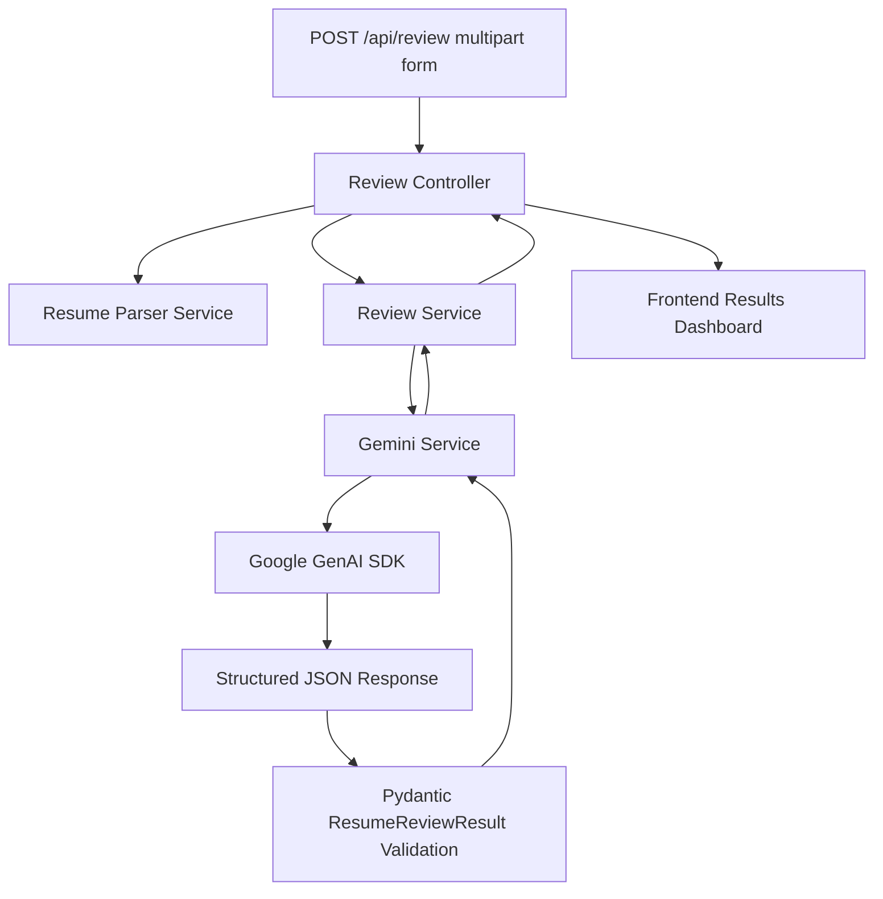

# AI Resume Reviewer

AI Resume Reviewer is a full-stack MVP that compares a resume against a target job description and returns structured AI feedback on match quality, ATS compatibility, skill gaps, keyword coverage, section quality, bullet rewrites, and next-step recommendations.

This is intentionally scoped as a no-auth, no-database MVP. Resume content is processed in memory for the request and is not persisted.

## Features

- Upload a PDF resume or paste resume text.
- Paste a target job description.
- Extract PDF text with `pypdf`.
- Generate a structured Gemini review response.
- Validate AI output with Pydantic before returning it.
- Render a polished dashboard with:
  - Overall Match
  - Estimated ATS compatibility
  - Skills Match
  - Experience Match
  - AI summary
  - Strengths
  - Skill gaps
  - Keyword analysis
  - Section reviews
  - Bullet improvements
  - Priority-grouped recommendations
- Friendly frontend error states for validation, network, unusable PDF text, oversized files, server errors, and AI provider failures.

## Tech Stack

Frontend:

- React
- Vite
- TypeScript
- Tailwind CSS
- shadcn/ui-style primitives
- Lucide React
- React Hook Form
- Zod
- React Router
- Vitest
- React Testing Library

Backend:

- FastAPI
- Pydantic v2
- pydantic-settings
- pypdf
- python-multipart
- google-genai
- pytest

## Architecture



Request flow:

1. The frontend submits `multipart/form-data` with either `resume` or `resume_text`, plus `job_description`.
2. The controller validates the request shape.
3. The parser extracts PDF text when a file is uploaded.
4. The review service validates usable resume/job-description text and calls Gemini.
5. Gemini is requested to return structured JSON.
6. The backend validates the AI response with Pydantic.
7. The frontend renders the validated dashboard or a friendly error state.

## Folder Structure

```text
AI_Resume_reviewer/
  backend/
    app/
      api/routes/
      controllers/
      core/
      middleware/
      prompts/
      schemas/
      services/
      utils/
    scripts/
    tests/
    .env
    .env.example
    requirements.txt
  frontend/
    src/
      assets/
      components/
        landing/
        layout/
        results/
        review/
        ui/
      lib/
      pages/
      test/
      types/
    package.json
    vite.config.ts
```

## Environment Setup

Backend `.env`:

```env
GEMINI_API_KEY=your_google_gemini_api_key
PORT=8000
FRONTEND_URL=http://localhost:5173
```

`GEMINI_API_KEY` is required at backend startup. The API fails fast if it is missing.

## Install And Run

Backend:

```powershell
cd backend
python -m venv .venv
.\.venv\Scripts\Activate.ps1
pip install -r requirements.txt
uvicorn app.main:app --reload --host 0.0.0.0 --port 8000
```

Frontend:

```powershell
cd frontend
npm install
npm run dev
```

Open:

```text
http://localhost:5173
```

## Testing

Backend:

```powershell
cd backend
.\.venv\Scripts\Activate.ps1
python -m pytest
```

Frontend:

```powershell
cd frontend
npm run test
npm run lint
npm run build
```

## API Contract

Endpoint:

```http
POST /api/review
Content-Type: multipart/form-data
```

Fields:

- `resume`: optional PDF file. Use this or `resume_text`, not both.
- `resume_text`: optional pasted resume text. Use this or `resume`, not both.
- `job_description`: required target job description.

Example request:

```bash
curl -X POST http://localhost:8000/api/review \
  -F "resume=@resume.pdf;type=application/pdf" \
  -F "job_description=Paste the full job description here..."
```

Success response:

```json
{
  "success": true,
  "data": {
    "overallScore": 88,
    "atsScore": 82,
    "skillsMatchScore": 91,
    "experienceMatchScore": 84,
    "strengths": ["Strong evidence for the core stack."],
    "matchedSkills": ["React", "FastAPI"],
    "missingSkills": ["SaaS domain language"],
    "keywordAnalysis": {
      "matchedKeywords": ["React"],
      "missingKeywords": ["SaaS"],
      "notes": "Good keyword coverage."
    },
    "sectionReviews": [
      {
        "section": "Experience",
        "score": 86,
        "feedback": "Relevant evidence."
      }
    ],
    "bulletImprovements": [
      {
        "original": "Built APIs.",
        "improved": "Built FastAPI services.",
        "reason": "More specific."
      }
    ],
    "recommendations": ["Add a targeted summary."]
  }
}
```

Error response:

```json
{
  "success": false,
  "error": {
    "code": "UNUSABLE_TEXT",
    "message": "Could not extract enough usable text from the resume."
  }
}
```

Status codes:

- `200`: success
- `400`: invalid input
- `413`: file too large
- `422`: unusable extracted text or request validation
- `500`: unexpected server error
- `502`: AI provider failure

## Validation Approach

Frontend:

- React Hook Form manages form state.
- Zod validates required fields and minimum lengths.
- File checks validate PDF type and 5MB size before submission.

Backend:

- Pydantic validates settings, request-level schemas, and Gemini output.
- PDF upload validation enforces content type, extension, file size, readability, and minimum extracted text length.
- Gemini output is schema-constrained where supported by the SDK, then validated again with Pydantic.
- Centralized exception handlers return a consistent `{ success: false, error }` shape.

## Security Notes

- `GEMINI_API_KEY` is loaded only by the backend and is never exposed to the frontend.
- Resume content is not persisted.
- There is no database in this MVP.
- The app does not log resume contents or API keys.
- Error responses avoid stack traces and internal exception details.
- CORS is restricted to `FRONTEND_URL`.

## Known Limitations

- No user accounts or authentication.
- No saved analysis history.
- No database or persistent storage.
- PDF extraction depends on embedded text; scanned/image-only PDFs may fail without OCR.
- ATS score is an estimate, not an exact ATS simulation.
- Gemini availability and quality depend on the configured provider key and model behavior.
- No rate limiting or abuse protection yet.

## Future Improvements

Not implemented in this MVP:

- V2: Database-backed review history.
- V2: User authentication and account management.
- V2: Saved resumes, job descriptions, and result exports.
- V3: Multi-model comparison across Gemini/OpenAI/Anthropic.
- V3: Resume version history and before/after diffing.
- V4: RAG over company/job-market knowledge.
- V4: Role-specific coaching and interview prep.
- V5: Career assistant workflows for applications, networking, and tailored cover letters.
